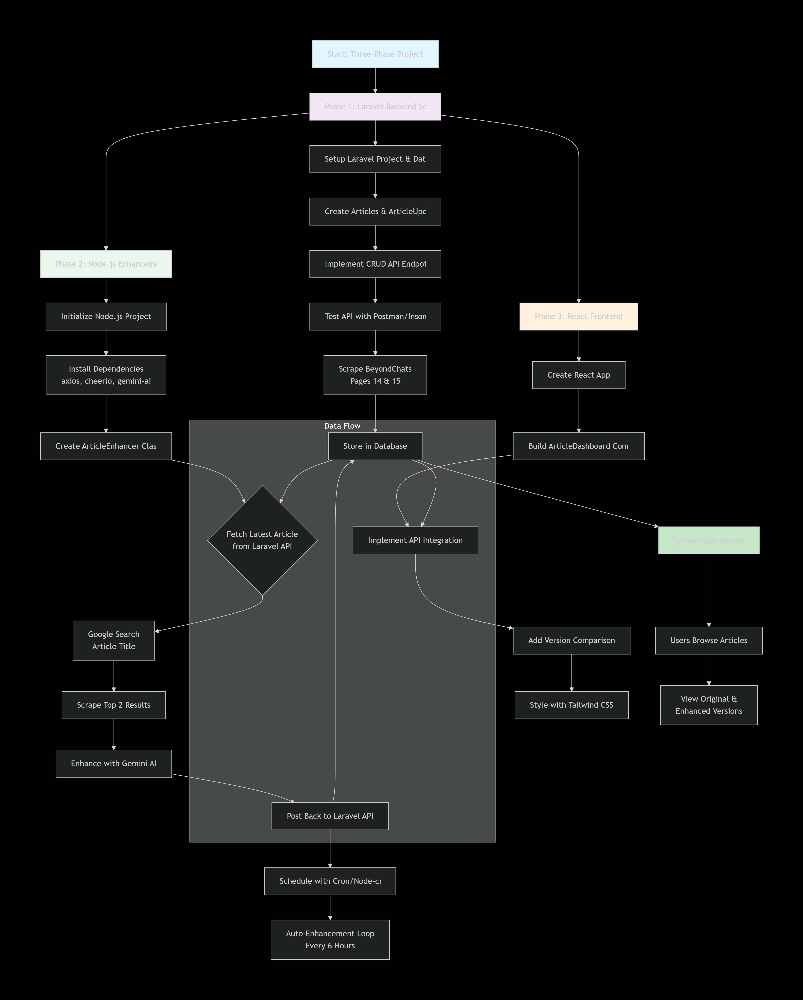

## Task Manager Pro – Complete Frontend Documentation

- Project overview
- System Architecture (explained + image reference)
- Data flow / flowchart (text + mapping to image)
- Frontend folder structure (matches your screenshot)
- Local setup instructions for React frontend

**Project Overview**
- This repository contains the complete ReactJS frontend for Task Manager Pro, a modern task management application. It offers a clean and responsive user interface that allows users to manage tasks efficiently, including features such as priority tracking, categorization, filtering, and real-time task statistics.


## **System Architecture Diagram**

- The following diagram (included in the project) represents the overall system design across all three phases.


## **Testing Flow Diagram**


## **Project Structure**
task-management/
- ├── public/
- │   ├── index.html
- │   ├── favicon.ico
- │   └── manifest.json
- ├── src/
- │   ├── assets/
- │   ├── components/
- │   ├── App.css
- │   ├── App.js
- │   ├── index.css
- │   └── index.js
- ├── .env
- ├── .gitignore
- ├── package.json
- ├── package-lock.json
- ├── tailwind.config.js
- └── README.md


**Core Technologies**
React 18.2.0 – Component-based UI library
JavaScript (ES6+) – Modern JavaScript features
Tailwind CSS 3.3.5 – Utility-first CSS framework
LocalStorage API – Client-side data persistence


**Development Tools**
Create React App – Project boilerplate
npm – Package management
ESLint – Code linting (React defaults)
Git – Version control


**Local Setup Instructions**
    - Prerequisites
    - Node.js 16.0 or higher
    - npm 8.0 or higher
    - Modern web browser (Chrome, Firefox, Edge)

## **Step 1:** Clone Repository
```bash
    git clone <repository-url>
    cd task-manager

    **Step 2:** Install Dependencies
    bash
    npm install
    This installs:

    React & React DOM
    Tailwind CSS & PostCSS
    Development dependencies

    **Step 3:** Verify Installation
    bash
    # Check Node version
    node --version

    # Check npm version
    npm --version

    # Verify package installation
    npm list react tailwindcss


    **Step 4:** Start Development Server
    bash
    npm start
    Application opens automatically at: http://localhost:3000

    **Step 5:** Build for Production
    bash
    npm run build
    Creates optimized production build in build/ folder.

    **Step 6:** Serve Production Build
    bash
    # Install serve globally
    npm install -g serve

    # Serve the build
    serve -s build -l 3000
```

## **Final Notes**
This frontend is part of a monolithic repository containing:

- **Laravel backend** (just understand how it's works)
- **Node.js LLM enhancement service** (lake of laveral experties not completed)
- **React frontend** (Compeleted)

All design and implementation decisions were made independently, with LLM/AI assistance used only for understanding Laravel API structure where clarifications were unavailable, while keeping real-world constraints and time limits in mind.